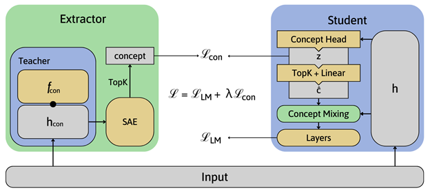
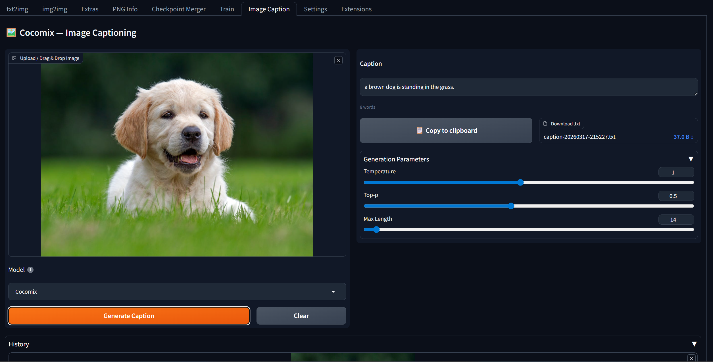

# Image Caption extension for Stable Diffusion Webui 👁️📜🖋️
[[paper]](paper.pdf)

The project explores integrating [Large Concept Models](https://github.com/facebookresearch/RAM/tree/main/projects/cocomix) into image captioning, achieving improved semantic fidelity and generalization over traditional GPT-2 baselines. The extension enables practical deployment of these models for dataset creation and real-world use in Stable Diffusion WebUI.



## Interface



## Results

Frozen LM setting

| Model         | BLEU-1 | BLEU-2 | BLEU-3 | BLEU-4 | METEOR | ROUGE | CIDEr | BERTScore |
|--------------|--------|--------|--------|--------|--------|-------|-------|-----------|
| GPT-2        | 0.5245 | 0.3516 | 0.2285 | 0.1460 | 0.1961 | 0.4844 | 0.4384 | 0.8922 |
| Cocomix      | 0.5847 | 0.4016 | 0.2647 | 0.1737 | 0.2033 | 0.4982 | 0.4660 | 0.8953 |
| Cocomix+PCE  | 0.6221 | 0.4267 | 0.2822 | 0.1841 | 0.2052 | 0.5060 | 0.4587 | 0.8967 |

Cocomix+PCE achieves the best results in the frozen language model setting, demonstrating the benefit of Prefix Concept Extraction for semantic alignment and caption quality.

## Code structure

```
scripts/
  image_caption.py          # A1111 extension entry point; Gradio UI + inference pipeline
  model/
    clipcap_model.py        # ClipCaptionModel, TransformerMapper, generate_clip_prefix()
    modeling_gpt2_cocomix.py  # GPT2CoCoMixLMHeadModel — Meta's Cocomix fork of GPT-2
  util/
    clipcap_utils.py        # Config helpers (merge_dicts, dict_to_obj, ParserObject)
                            # + get_base_lm() which loads either Cocomix or NTP GPT-2
javascript/
  copy_btn.js               # cocomixCopyCaption() — clipboard helper called via Gradio _js
  model_tooltip.js          # Injects CSS for the model-selector tooltip UI
```

### Inference Flow

1. `script_callbacks.on_ui_tabs(on_ui_tabs)` registers the tab with A1111.
2. On "Generate Caption" click, `get_caption()` (a generator) is called.
3. If the model or model choice changed, weights are downloaded from HuggingFace and assembled:
   - CLIP `ViT-L/14` encodes the image → 768-dim prefix.
   - `TransformerMapper` projects the CLIP prefix into GPT-2 embedding space.
   - GPT-2 (`Cocomix` or `NTP` variant) decodes token-by-token with top-p sampling.
4. Generation stops at the first `.` token; the result is trimmed and returned.

### Two Model Modes

- **Cocomix**: `GPT2CoCoMixLMHeadModel` — adds a concept prediction head at a configurable layer (`insert_layer_index`). Configured via `gpt2_69m_cocomix.yaml`. Uses `eager` attention.
- **NTP** (Next-Token Prediction): plain `GPT2LMHeadModel` baseline. Configured via `gpt2_69m_ntp.yaml`. Uses `sdpa` attention.

Config is loaded by merging `config.yaml` (shared base) with the model-specific YAML, converted to a `SimpleNamespace` via `dict_to_obj`.

## Installation

Require A1111 WebUI, paste the git link to install this extension